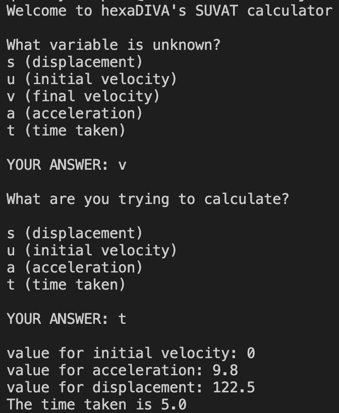

# SUVAT calculator (aka. suvat-calc)
This is my first ever major project written entirely in Julia, which is what made the creation of this feel more exciting for me!
I decided to make a calculator project, one that uses the 5 equations that link __displacement__ (s), __initial velocity__ (u), __final velocity__ (v), __acceleration__ (a), and __time__ (t) together. Physicists, you know exactly what I'm talking about.

## The 5 SUVAT equations
1. v = u + at
2. s = 1/2 (u + v) * t
3. s = ut + 1/2 at^2
4. v^2 = u^2 + 2as
5. s = vt - 1/2 at^2

## How does this work?

Each equation focuses on four of the variables mentioned earlier. In order to figure out which equation the user should use, they are first asked which variable they do not know the value of.

Once they state this, they are then asked which one of the variables remaining they wish to calculate. Depending on which variable they choose, the equation will then be rearranged to find that.

They are then asked to provide the values for the remaining three variables. Once they do that, the result is calculated and printed to them.
